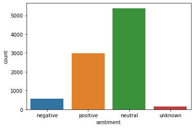
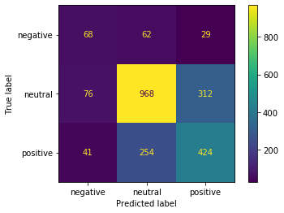
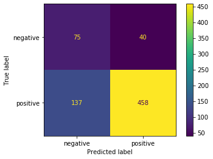
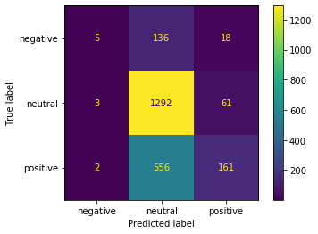

# Phase 4 Project - NLP - Twitter Sentiment Dataset

## Final Project Submission

* Student name: Catherine Fritz
* Student pace: part time
* Scheduled project review date: July 15, 2021
* Instructor name: Josh Johnson

### Business Understanding
Businesses often wish to get feedback on their products, however getting direct feedback usually requires that someone takes time to write something like a product review. People informally talk about their lives in social media like Twitter, and could be a source of informal product feedback. Being able to automatically capture product sentiment, like if a product was being received positively or negatively, could gain companies insight into how their product is being perceived.

### Data Understanding
The data used for this project is a collection of tweets that have been classified by a human as to whether they are positive, negative, neutral, or if the sentiment is unknown. Further, the subject of the tweets center around Apple or Android products.

Looking at the data, we see that we do have a bit of an imbalance, with a large majority of the classes in the neutral and positive categories. I left the data as it is, but the affect that has the models will be shown later. Also, I decided that the unknown class could be removed, since it does not provide useful information for identifying a sentiment.

### Data Preparation
To make the data suitable for modeling, the following steps were taken:

- Remove undesirable characters
- Remove Twitter specific text like @ tags
- Tokenize the text
- Remove common stop words for the English language and also specific to Twitter (like "RT" or "link").
- Lemmatize the stop words to consolidate similar words
- Vectorize the tokens to be used by classification models

### Modeling & Evaluation
For my first model, I used logistic regression. Below are the accuracies achieved for the train and test sets and also the confusion matrix.
Training Accuracy is: 87.0%
Validation Accuracy is: 65.4%

For my second model, I used a decision tree classifier.
Training Accuracy is: 95.8%
Validation Accuracy is: 66.0%

For my third model, I used a gradient boosted model, XG Boost.
Training Accuracy: 68.55%
Validation accuracy: 65.26%

### Conclusion
For the business purpose, it is the most useful to identify a positive or negative sentiment as a neutral sentiment does not give us additional information about a project. Based on this, the best model was my first logistic regression for it ability to identify both positive and negative sentiments. The other models sacrificed ability to identify negative sentiments in favor of accuracy. In this case, a higher accuracy could be achieved by simply picking "neutral" most of the time. For future work, I would want to address this class imbalance.

### Deployment
For More Information, please review my full analysis in Jupyter Notebook or my presentation.

For any additional questions, please contact Catherine Fritz: cmfritz0@gmail.com.

## Repository Structure
#### Main Page
    ├── README.md                              <- The top-level README for reviewers of this project
    ├── jupyter_notebook.pdf                   <- PDF version of project notebook
    ├── nlp_notebook.ipynb                     <- master notebook
    ├── data                                   <- folder where data exists
    ├── images                                 <- folder where data visualizations and graphics are located

#### Data
    ├── judge-1377884607_tweet_product_company.csv           <- Tweet data .csv file

#### images
    ├── *.png                                  <- various .png files
