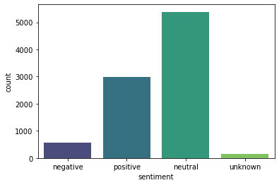
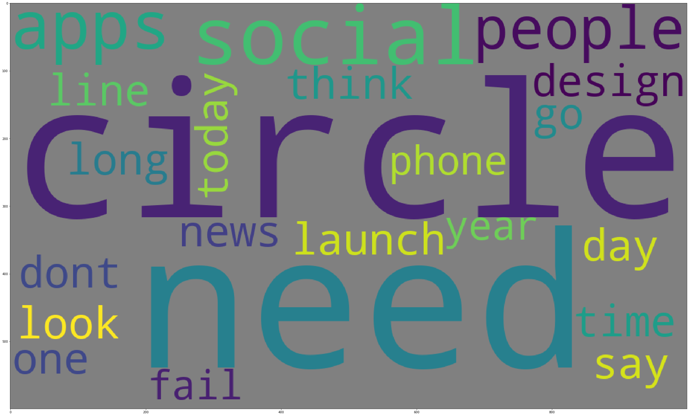
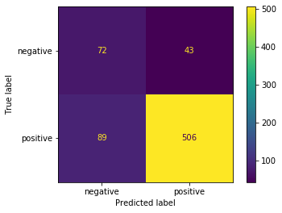
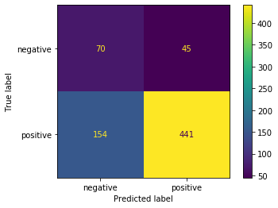

## Natural Language Processing Project - Twitter Sentiment

### Business Understanding
Businesses often wish to get feedback on their products, however getting direct feedback usually requires that someone takes time to write something like a product review. People informally talk about their lives in social media like Twitter, and could be a source of informal product feedback. Being able to automatically capture product sentiment, like if a product was being received positively or negatively, could gain companies insight into how their product is being perceived.

### Data Understanding
The data used for this project is a collection of tweets that have been classified by a human as to whether they are positive, negative, neutral, or if the sentiment is unknown. Further, the subject of the tweets center around Apple or Android products.

Looking at the above chart, we see that we do have a bit of an imbalance, with a large majority of the classes in the neutral and positive categories. To hone in classifying an actual sentiment, I removed the unknown and neutral classes, since the unknown class does not provide useful information, and the neutral class does not capture a sentiment one way or another.

To address the imbalance, SMOTE was used to add values via oversampling to the negative class.

### Data Preparation
To make the data suitable for modeling, the following steps were taken:

- Remove undesirable characters
- Remove Twitter specific text like @ tags
- Tokenize the text
- Remove common stop words for the English language and also specific to Twitter (like "RT" or "link").
- Lemmatize the stop words to consolidate similar words
- Vectorize the tokens to be used by classification models

I created a bag of words for each of the sentiments, and below are the top words associated with positive and negative sentiments. Stopwords were removed.  

Positive:

 
Negative:

### Modeling & Evaluation
#### Model 1 - Logistic Regression
For my first model, I used logistic regression and also ran a grid search on it. Below are the results from the model after the grid search was run.

Training Accuracy: 99.66% 
Test Accuracy: 81.41%

Training F1 Score: 99.66% 
Test F1 Score: 52.17%

Confusion Matrix for test data: 

#### Model 2 - Decision Tree
For my second model, I used a decision tree classifier. Below are the results.

Training Accuracy: 99.69% 
Test Accuracy: 75.07%

Training F1 Score: 99.69% 
Test F1 Score: 45.87%

Confusion Matrix for test data: 

#### Model 3 - XG Boost
For my third model, I used a gradient boosted model, XG Boost. Below are the results.

Training Accuracy: 82.42% 
Test Accuracy: 71.97%

Training F1 Score: 83.68% 
Test F1 Score: 41.3%

Confusion Matrix for test data: 

### Feature Importance
The logistic regression model will be selected, so let's look at top influential features for the Linear Regression model.

### Conclusion
#### Results
For the business purpose, it is the most useful to identify a positive or negative sentiment as a neutral sentiment does not give us additional information about a project. Based on this, the selected model is the grid-searched logistic regression model (Model 1b). The reason for choosing this mode is that it can predict positive sentiments better than other models, while achieving about the same negative predictions as than the other models. This is reflected by the f1 scores and confusion matrices for the test data. The other models had reduced ability to identify positive cases while only slightly better performing with the negative cases.
#### Recommendations
Based on these findings, it is recommended that:
1. Tweets can be analyzed via machine learning to capture sentiments
2. The model should be periodically retrained with new data to improve results, especially for the negative class
3. The top words give a variety of insight into why people are posting tweets in the first place. For example "free" could indicate the occassion to tweet about a product, while "great" is how a tweeter feels. One interpretation could be one could encourage reviews by giving out free products.

### Deployment
For More Information, please review my full analysis in Jupyter Notebook or my presentation.

For any additional questions, please contact Catherine Fritz: cmfritz0@gmail.com.

### Repository Structure
#### Main Page
    ├── README.md                              <- The top-level README for reviewers of this project
    ├── jupyter_notebook.pdf                   <- PDF version of project notebook
    ├── nlp_notebook.ipynb                     <- master notebook
    ├── data                                   <- folder where data exists
    ├── images                                 <- folder where data visualizations and graphics are located

#### Data
    ├── judge-1377884607_tweet_product_company.csv           <- Tweet data .csv file

#### images
    ├── *.png                                  <- various .png files
